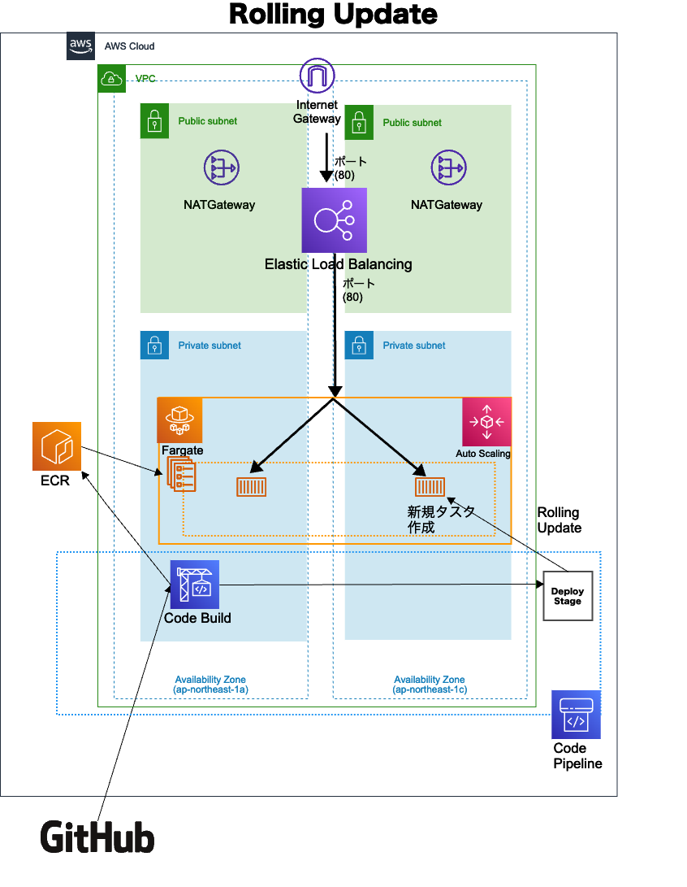

# Fargate CI/CD Pipelineの比較

## 概要

Fargateに対して、Rollingアップデートパイプラインを構築するCFnテンプレートを格納しています。
なお、SourceステージはGitHub、パイプラインはAWS CodePipelineを用いて構築します。

## ファイル構成

```[text]
.
├── README.md
├── cicd-rolling.yaml // Rolling Update用のパイプライン構築
├── ecr-rolling.yaml // Rolling Update用のパイプライン構築
├── ecs-rolling.yaml // Rolling Update用のECS構築
├── vpc.yaml // VPC構築
├── images  // 画像を保存
│   └── RollingUpdate.png
└── parameters // パラメータファイルを保存
    ├── system_dev_cicd-rolling_parameter.json
    ├── system_dev_ecr-rolling_parameter.json
    ├── system_dev_ecs-rolling_parameter.json
    └── system_dev_vpc_parameter.json
```

## 構成図面



## 命名規則

作成リソースは下記命名規則の前提。（vpcを除く）

```[text]
<システム名>-<環境名>-<デプロイ名>
```

## 構築順序

構築順序は下記前提。

- vpc.yaml
- ecr-rolling.yaml
  - 構築後、latestタグを付与したイメージをpushすること
- ecs-rolling.yaml
  - vpcの値に合わせてパラメータファイルを更新すること
- cicd-rolling.yaml
  - vpc・ecsの値に合わせてパラメータファイルを更新すること
  - 初回実行は失敗する。マネジメントコンソールからGitHubとの接続を行なって再度パイプラインを実行すること

AWS CLIで下記のコマンドを実行することで、スタックを構築します。

```[shell]
aws cloudformation create-stack \
--stack-name スタック名 \
--template-body file://./テンプレート名 \
--capabilities CAPABILITY_NAMED_IAM \
--parameters file://./parameters/パラメーター名 \
--tags Key=Environment,Value=<Environmentに設定する変数値> \
--tags Key=SystemName,Value=<SystemNameに設定する変数値>
```